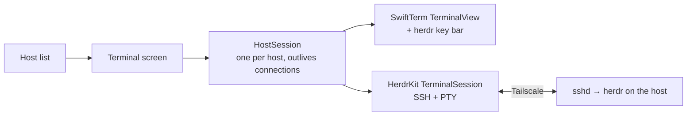

# Herdr for iPhone and iPad

A universal SwiftUI app that reaches [herdr](https://github.com/ogulcancelik/herdr) on your Macs
and Windows PC over Tailscale. It opens an SSH connection with a PTY, runs herdr's attach command on
the host, and renders the live TUI with SwiftTerm. herdr keeps every session running on the host,
so the app can drop and reattach freely. Why it is built this way:
[ADR 0001](docs/adr/0001-ssh-terminal-client.md).



## Setup

1. **Tailscale on the device.** Install Tailscale from the App Store, sign in to your tailnet, and
   leave the VPN on. Hosts are reached by MagicDNS name (`jamess-macbook-pro`) or `100.x` address.
2. **SSH on each host.** macOS: turn on Remote Login. Windows: install and start OpenSSH Server.
   herdr must be installed on the host. [docs/host-setup.md](docs/host-setup.md) has the exact
   steps and the attach command each platform runs.
3. **Authorize this device's key.** Each device makes its own Ed25519 key in its Keychain (it
   never leaves the device). In the app, tap the key button, then Copy Key or Share Key. On the
   host, add it with the helper, which is idempotent and tags the line `herdr-ios` for easy
   revocation:

   ```sh
   scripts/authorize-key.sh local "ssh-ed25519 AAAA… herdr-ios"          # on the Mac itself
   scripts/authorize-key.sh james@jamess-macbook-pro ~/Downloads/key.pub  # from another machine
   scripts/authorize-key.sh volpe@supedupsilly "ssh-ed25519 AAAA…" --platform windows
   ```

   Pasting the line into `~/.ssh/authorized_keys` by hand also works.
4. **Add the host.** Tap +, then enter a name, the hostname, port, user, and platform. You can
   also set a herdr session name (empty means herdr's default session), a command override, and a
   password fallback that is kept in the Keychain.
5. **Connect.** Tap the host. On the first connection the app shows the host key's SHA256
   fingerprint. Check it on the host with `ssh-keygen -lf /etc/ssh/ssh_host_ed25519_key.pub` (on
   Windows, `ssh-keygen -lf C:\ProgramData\ssh\ssh_host_ed25519_key.pub`), then tap Trust.

## Using it

- **Key bar** above the keyboard: `⌃B` (herdr's prefix), `esc`, sticky `ctrl` (applies to the next
  key), `tab`, arrows, `|`, `~`, `/`, `-`, and a button that hides the keyboard. The toolbar's
  keyboard button brings it back.
- **Taps click** in herdr once herdr turns on mouse reporting, even when the keyboard is hidden.
  One-finger drags are mouse drags. Two-finger drags, or an iPad trackpad or mouse wheel, scroll.
- **Pinch** to change the font size. The terminal reflows and herdr gets the new size.
- **Layouts.** Below 64 columns herdr switches to its mobile layout, which is what iPhone portrait
  gets. Landscape and iPad get the desktop layout. Rotation, Split View, and Stage Manager resizes
  reflow the terminal.
- **Hardware keyboard and pointer** work on iPad, including `ctrl+b`.
- **Background and return.** Going to the background closes every live connection. Coming back
  reattaches the host on screen. Other hosts reattach when you open them, because herdr resizes a
  session's panes to its newest client and a hidden reattach would reflow them at your desk. A
  session you ended with `ctrl+b q` stays ended. Switching hosts in the sidebar while the app is open
  keeps the other hosts attached.
- **Editing a connected host** (address, user, platform, session, command) reconnects it with the
  new settings.
- **Changed host key.** If a host's key changes, the connection is refused. After a legitimate
  reinstall, open Edit Host, tap Forget Host Key, and trust the new key on the next connection.

herdr sizes every pane in a session to its foreground client. Attaching a phone to the session you
use at your desk therefore resizes that session's panes. Give the phone its own session, for
example `phone`, in the host's herdr session field.

## Build

Requirements: Xcode 27 with the Metal Toolchain component (SwiftTerm ships Metal shaders), and
XcodeGen. The `.xcodeproj` is generated and not checked in.

```sh
xcodebuild -downloadComponent MetalToolchain   # once per Xcode install
xcodegen generate
xcodebuild -project Herdr.xcodeproj -scheme Herdr \
  -destination 'generic/platform=iOS Simulator' -skipPackagePluginValidation build
```

`-skipPackagePluginValidation` trusts SwiftTerm's build-info plugin from the command line. In
Xcode you approve it once instead.

To install on a paired device:

```sh
xcodebuild -project Herdr.xcodeproj -scheme Herdr -destination 'generic/platform=iOS' \
  -derivedDataPath build -allowProvisioningUpdates -skipPackagePluginValidation build
xcrun devicectl device install app --device <udid> build/Build/Products/Debug-iphoneos/Herdr.app
xcrun devicectl device process launch --device <udid> com.volpestyle.herdr
```

## Layout

| Path | Contents |
| --- | --- |
| `App/` | The SwiftUI app: host list and editor, device key screen, terminal screen, key bar |
| `Packages/HerdrKit/` | SSH transport, host store, device key, host-key pinning |
| `project.yml` | XcodeGen spec (bundle `com.volpestyle.herdr`, iOS 26+, iPhone and iPad) |
| `scripts/` | Host helpers such as `authorize-key.sh` |
| `docs/` | Plan, ADRs, host setup, lane records and evidence |
