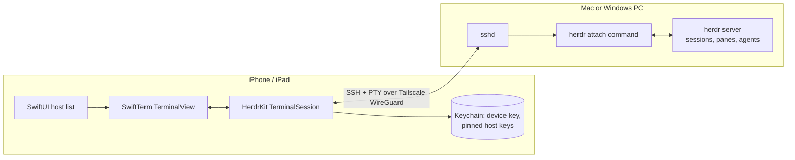

# ADR 0001: The app is a native SSH terminal client that attaches to herdr on the host

Status: accepted (2026-09-21)

## Context

herdr is a Rust TUI plus a background server. Each host keeps its sessions alive, and a client
reattaches with `herdr` (or `herdr --session <name>`) from any terminal, including over SSH. Below
64 columns the TUI switches to its own mobile layout (`DEFAULT_MOBILE_WIDTH_THRESHOLD = 64`), so
iPhone portrait gets herdr's mobile UI and iPad gets the full desktop layout.

The goal is to reach herdr on any of my Macs or my Windows PC from an iPhone or iPad over Tailscale.

## Options weighed

1. **Native SSH + terminal emulator.** SSH with a PTY into the host, run herdr there, and render
   the byte stream in an embedded terminal emulator. herdr owns rendering and persistence, so
   every herdr feature works on day one. The app only handles transport, input and lifecycle.
2. **Port the herdr thin client (`herdr --remote`) to iOS.** This speaks herdr's private client
   protocol, but it still needs a terminal renderer. The protocol is private and versioned
   (`PROTOCOL_VERSION`), and the Unix bridge refuses Windows hosts ("remote Windows hosts are not
   supported yet").
3. **Native SwiftUI client for herdr's JSON socket API.** Good for agent status and prompting, but
   it can't show live panes. Better as a later add-on (an agent overview over an SSH exec
   channel) than as the core.
4. **Web wrapper (ttyd, VNC, and similar).** Adds a daemon on every host and gives a worse
   keyboard and lifecycle story.

## Decision

Option 1. Pieces:

- **Network: the Tailscale iOS app.** The device joins the tailnet as a VPN, and hosts are
  reached by MagicDNS name or `100.x` address. Nothing from Tailscale is embedded in the app.
- **Transport: SSH via Citadel on swift-nio-ssh.** Auth uses a per-device Ed25519 key stored in
  the Keychain (this-device-only), with password as a fallback. The app requests a PTY, runs the
  herdr attach command, and forwards window changes on resize. Host keys are pinned on first use
  with an explicit prompt, and a changed key is a hard stop.
- **Terminal: SwiftTerm `TerminalView` (UIKit).** It is wrapped for SwiftUI and adds an accessory
  row for herdr: the prefix `ctrl+b`, esc, tab, ctrl and arrows. Taps act as mouse clicks when
  herdr enables mouse reporting. Hardware keyboards and pointers work on iPad.
- **Lifecycle.** iOS drops the socket in the background. On return to the foreground the app
  reconnects and reattaches, and herdr has kept every agent running in the meantime.
- **Hosts.** macOS uses Remote Login (OpenSSH). Windows uses the built-in OpenSSH Server, with
  herdr running natively there. The default attach command per platform is documented in
  `docs/host-setup.md`.

## Consequences

- Rendering fidelity and features track the herdr binary on each host with no app changes.
- Each host needs SSH enabled and the device's public key authorized. The app shows its key for
  copying.
- Any herdr-protocol-level integration (a native agent overview, notifications) comes later and
  runs on SSH exec channels, reusing the same connection and credentials.
