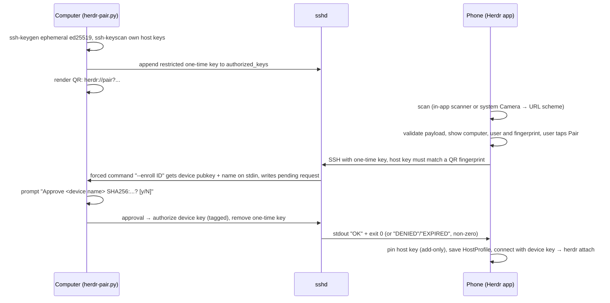

# ADR 0002: QR pairing enrolls a device through a one-time, forced-command SSH key

Status: accepted (2026-09-21)

## Context

Adding a computer takes four manual steps: export the device key, authorize it on the host, type
the hostname and user, and compare the host-key fingerprint. Pairing should be: run one command
on the computer, scan with the phone, approve on the computer, and land in herdr.

Constraints:

- The phone's private key never leaves its Keychain. A pairing must never overwrite an existing
  host-key pin (`HostKeyPins` is add-only), and it must never accept a `remoteCommand` from a
  QR code.
- It works on macOS and Windows hosts with what's already there: sshd, `ssh-keygen`, Python 3
  (3.9 on the Mac, 3.11 on the PC), and Tailscale.
- herdr upstream isn't ours to change. A native `herdr pair` can come later, and this protocol
  is shaped so it can move there unchanged.

## Options weighed

1. **One-time SSH key with a forced command (chosen).** The computer mints an ephemeral Ed25519
   key and authorizes it with `restrict`, `from=<tailnet>`, `expiry-time=` and
   `command=<enroll>`. The QR code carries that key's seed and the host's key fingerprints. The
   phone SSHes in with the one-time key, the host key is verified against the QR (no TOFU prompt),
   and the forced command receives the device's public key, waits for approval on the computer,
   and authorizes it. No new daemon or port is needed, it rides the existing HerdrKit transport,
   and the credential expires on its own.
2. **Temporary HTTP listener on the tailnet IP.** This needs a new listener, its own firewall
   exceptions on Windows (HttpListener URL ACLs), and a second authentication scheme.
3. **Password bootstrap, then install the key.** Needs password auth enabled on sshd, and typing a
   password isn't pairing.
4. **Tailscale SSH (tailnet identity instead of keys).** Not supported by the macOS GUI build or on
   Windows.

## Protocol v1



**Payload.** A URL, so the system Camera opens the app:
`herdr://pair?v=1&id=…&n=…&u=…&os=unix|windows&h=…&p=22&fp=…&k=…&x=…[&s=…]`

| Key | Meaning | Phone-side validation |
| --- | --- | --- |
| `v` | protocol version, `1` | reject anything else |
| `id` | pairing id, 16 random bytes, base64url | 22 chars `[A-Za-z0-9_-]` |
| `n` | computer display name | ≤ 64 chars, shown to the user, never executed |
| `u` | SSH username | ≤ 64 chars, no control chars or whitespace |
| `os` | `unix` or `windows` | enum |
| `h` | comma list of hostnames, preferred first (MagicDNS FQDN, then short name, then `100.x`) | each canonicalized via `HostKeyPins.canonical`; ≤ 4 entries; tailnet names/IPs only (`*.ts.net`, a single label, `100.64.0.0/10`, `fd7a:115c:a1e0::/48`) |
| `p` | SSH port | 1–65535 |
| `fp` | comma list of `SHA256:` host-key fingerprints (ed25519 and ecdsa; no RSA) | 1–3 entries, exact `SHA256:<43 base64>` |
| `k` | one-time Ed25519 private seed, 32 bytes, base64url | exactly 32 bytes |
| `x` | expiry, Unix seconds | reject if past, or more than 15 min ahead of the phone clock |
| `s` | optional herdr session name | herdr's `[A-Za-z0-9._-]{1,64}` |

Anything else (including a `cmd`/`remoteCommand` key) is ignored. `remoteCommand` stays nil on
the saved profile.

**One-time key line.** It goes in the same file `scripts/authorize-key.sh` targets (unix:
`~/.ssh/authorized_keys`; Windows: per-user or `administrators_authorized_keys` per the sshd
`Match Group administrators` block):

```
restrict,expiry-time="YYYYMMDDHHMMSS",from="100.64.0.0/10,fd7a:115c:a1e0::/48,127.0.0.1,::1",command="<python> <herdr-pair.py> --enroll <id>" ssh-ed25519 AAAA… herdr-pair:<id>
```

TTL is 10 minutes. The helper removes the line on success, denial, timeout, Ctrl+C and exit.
`expiry-time` is the backstop if the helper dies.

**Enroll exchange.** This is an exec channel with no PTY. The phone writes exactly two lines to
stdin: its OpenSSH public key (`ssh-ed25519 <b64>`) and a device name (≤ 64 printable chars). The
forced command validates both and writes a pending request to the helper's per-user state
directory. It then waits up to 120 s for the helper's decision. On approval it authorizes the key
with the comment `herdr-ios:<device name>:<date>` and prints `OK`, exiting 0. Otherwise it prints
`DENIED` (exit 3) or `EXPIRED` (exit 4). A second enroll for the same id is refused, because the
key is single use.

**Phone after OK.** Pin the presented host key under the hostname that connected
(`HostKeyPins.pin`, add-only). If a different pin already exists for that host:port, pairing is
refused before the one-time key is used. Then save the `HostProfile` (name `n`, hostname =
the entry that connected, `u`, `p`, `os`, session `s`), connect with `DeviceKey`, and attach.

## Threat model

- **QR leak (photo or shoulder-surf within the TTL).** The attacker also needs a tailnet node
  (`from=`), gets only the forced command, and their device key still needs the human's `y` on
  the computer, which shows the device name and key fingerprint.
- **Malicious QR.** It can't set a command. It can only name a host on the tailnet. The phone
  shows the computer and account before connecting, and the host key must match the QR, so a
  malicious QR gets you a session to a machine the attacker already controls. That's the same
  trust as typing that host in by hand.
- **Existing pins win.** A QR can't re-pin a host whose key changed. After `OK` the phone checks
  the pin state again before pinning, so a pin written in the meantime by another session is
  never replaced.
- **Concurrent enrolls.** The forced command claims the pairing id atomically (exclusive create),
  so a second enroll is refused. The approval is bound to the exact key fingerprint shown in the
  prompt and can't be swapped afterwards.
- **Forced command on Windows.** `restrict` and `command=` have to deny arbitrary exec, PTY and
  forwarding under Windows OpenSSH too. This is verified, not assumed.
- **Secrets at rest.** Neither the seed nor the full pairing URL is logged by the helper, HerdrKit
  or the app. The helper prints the URL only behind an explicit test flag.

## Consequences

- One script (`scripts/herdr-pair.py`, vendored MIT QR encoder, stdlib only) runs on both macOS
  and Windows. Users copy it to each computer, and later a herdr plugin or upstream `herdr pair`
  can ship it.
- Manual host entry and `scripts/authorize-key.sh` stay as the fallback.
