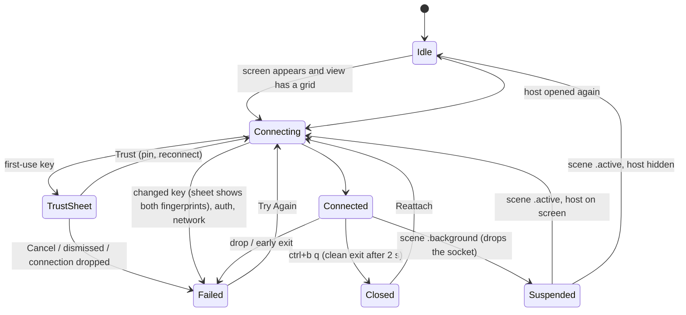

# Lane: app (w29:p3)

Owned paths: `project.yml`, `App/**`, `README.md`, `docs/lanes/app.md`, `docs/evidence/app/**`.

Stage: done on the iPhone 17 Pro Max and iPad Pro 13-inch (M5) simulators, against this Mac and
against the Windows PC `supedupsilly`, both over Tailscale. The signed build is installed and
running on the physical iPhone. The iPad install waits on the iPad being unlocked (see
[Devices](#devices)).

## What exists

- `App/HostsView.swift`: a `NavigationSplitView` host list. It collapses to a push stack on
  iPhone and hides the sidebar on iPad once a host is selected, so the terminal gets the full
  width. Add, edit and delete are in the toolbar, context menu and swipe actions. The key button
  opens the device key screen.
- `App/HostEditor.swift`: name, hostname, port, user, platform, herdr session, command override
  and password. The session is checked with `HerdrCommand.sessionNameError` (Save is disabled
  while it's invalid, unless a command override replaces the attach command). The placeholder
  previews the attach command. Saving a change to the address, user, platform, session or command
  reconnects a live session. Forget Saved Password shows only when a password is saved.
  **Forget Host Key** asks for confirmation and clears the pin for the *saved* address.
- `App/DeviceKeyView.swift`: `DeviceKey.publicKeyOpenSSH()` with Copy and Share.
- `App/HostSession.swift`: one `HostSession` per host, kept in `SessionRegistry`. It owns a
  SwiftTerm view that outlives individual `TerminalSession`s, so switching hosts in the sidebar,
  or popping back on iPhone, leaves the other sessions attached.
- `App/TerminalContainer.swift`: `HerdrTerminalView` (a SwiftTerm `TerminalView` subclass), the
  hosting view with its gestures, and the `KeyBar` input accessory.
- `App/TerminalScreen.swift`: the terminal, a status overlay (connecting, reconnecting, failed
  with the multi-line reason, session ended), and the host-key sheet.



`Closed` and `Failed` stay as they are across a trip to the background, because they have no
socket to lose.

### Decisions

- **Drop live connections on background, and reattach only the host on screen.** iOS kills
  sockets once an app is suspended, and HerdrKit has no keepalive, so a dead connection can still
  read `.connected`. `suspend()` drops every live connection. `resume()` reattaches only a host
  whose terminal is in the window. herdr makes the newest attached client the foreground client
  and sizes every pane in that session to it (`headless.rs` sets `foreground_client_id` on every
  non-direct attach). So a hidden host reattaching on unlock would reflow a desk client's panes to
  phone width. Hidden hosts reattach through `start()` when they are opened. `inBackground` gates
  every connect path, because iOS lays views out for app-switcher snapshots while backgrounded.
  The queued connect task re-checks that it is still the current connection before it calls
  `connect`. `App/Tests/HostSessionTests.swift` pins all of this. Mutation check: without the task
  guard, retired sessions went from `.idle` to `.failed`.
- **An approval only counts for the connection that asked.** Dropping a connection answers any
  open trust prompt with "no", and a generation counter keeps a stale `TerminalSession` from
  raising a new one. Trust is in the `.primaryAction` slot, not `.confirmationAction`. The
  confirmation slot is the sheet's default action, and a reflexive Return on a hardware keyboard
  must never trust an unverified key.
- **Taps with the keyboard hidden.** SwiftTerm spends a tap on an unfocused view becoming first
  responder, so that tap never reaches herdr. `HerdrTerminalView.sendClick` reports it as a left
  click itself (SwiftTerm 1.20 already sends focused taps as button 0). Hiding the keyboard from the
  key bar turns off `canBecomeFirstResponder`, so later taps only click. The toolbar keyboard
  button brings it back.
- **Windows mouse encoding (SwiftTerm bug, worked around in the app).** ConPTY on the PC sends
  `?1000h ?1002h ?1003h ?1006h` and then `?1016l`. SwiftTerm, both 1.20 and `main` as of
  2026-09-19, sets the mouse encoding to X10 on *any* encoding DECRST (`cmdResetMode` `case 1016`),
  even when that encoding isn't active. xterm clears only the active one. Every click then went out
  as X10 bytes, and ConPTY typed them into PowerShell as text
  (`~+#~+echo herdr-ios-tapped-right`). `HerdrTerminalView.feedHost` drops the exact `ESC[?1016l`
  sequence before feeding SwiftTerm. `HostSessionTests.conptyMouseModesKeepSGRClicks` fails without
  it: the click comes out as `ESC[M #"`. This is tech debt, and the real fix is upstream (see
  [Gaps](#gaps)).
- **Scrolling.** With herdr's mouse reporting on, one-finger drags are mouse drags, so there is no
  touch path to herdr's scrollback. Two-finger pans, and trackpad or wheel scrolls
  (`allowedScrollTypesMask = .all`), send wheel events at the touch location.
- **One scene.** `UIApplicationSupportsMultipleScenes` is false, because a session's terminal view
  can live in only one window. Split View and Stage Manager resizes still reflow.
- **Dark keyboard.** `keyboardAppearance = .dark` and a dark `KeyBar`. On a light-mode phone the
  gray key-bar buttons otherwise wash out against the light keyboard.
- **UI-test steady caret.** XCUITest waits for animations to settle before every action, and
  SwiftTerm's caret blink repeats forever (about 60 s per action). A `-steadyCaret` launch argument
  maps blink cursor styles to steady ones in `cursorStyleChanged`. Normal launches are unchanged.

## Evidence

Every run used the throwaway herdr session `herdr-ios-test` and never a host's default session
(herdr sizes all panes to the foreground client). The session was deleted and recreated before each
live run, and deleted on both hosts afterwards. Screenshots are in
[`docs/evidence/app/`](../evidence/app/).

### This Mac (`100.103.220.58`, user `james`, unix)

`HerdrUITests.testLiveHerdr` passed on both simulators with the final code. The host was added
through the editor.

| Step | iPhone | iPad | Host-side proof |
| --- | --- | --- | --- |
| Add host via editor | `iphone-add-host-filled.png` | `ipad-add-host-filled.png` | |
| First-use trust sheet | `iphone-trust-host-key.png` | `ipad-trust-host-key.png` | fingerprint matches `ssh-keygen -lf` |
| Live herdr TUI | `iphone-connected-portrait.png` (mobile layout) | `ipad-connected-portrait.png` (desktop layout) | |
| Typing, `↑` recall, sticky `ctrl`+`u` | `iphone-typed.png` | `ipad-typed.png` | pane `w1:p1`: `herdr-ios-typed` ×2, `herdr-ios-ctrl-ok`, no `ctrl-FAIL` |
| `⌃B` then `v` splits | `iphone-prefix-split-portrait.png` | `ipad-prefix-split-portrait.png` | `pane list`: `w1:p1`, `w1:p2` |
| Rotate to landscape | `iphone-landscape.png` (desktop layout) | `ipad-landscape.png` | |
| Tap left pane (keyboard up), tap right pane (keyboard hidden) | `iphone-tapped-landscape.png` | `ipad-tapped-landscape.png` | `w1:p1` has `herdr-ios-tapped-left`, `w1:p2` has `herdr-ios-tapped-right` |
| Rotate back | `iphone-rotated-back-portrait.png` | `ipad-rotated-back-portrait.png` | |
| Home, 8 s, reopen: auto reattach | `iphone-reattached.png` | `ipad-reattached.png` | new herdr client pid: iPhone 23869 → 24506, iPad 24805 → 25435 |

### Windows PC (`supedupsilly`, `100.108.214.60`, user `volpe`, windows)

Verdict: **works.** The same `testLiveHerdr` passed on both simulators against the PC's
PowerShell panes (herdr 0.9.0, OpenSSH for Windows), with `HERDR_TEST_KILL_LINE=c`. PowerShell's
Windows edit mode cancels the line on ctrl+c and leaves ctrl+u unbound. The first run showed the
mouse-encoding bug above. These results are from after the fix.

| Step | iPhone | iPad | PC-side proof (`herdr pane read` over SSH) |
| --- | --- | --- | --- |
| Host list | `windows-iphone-hosts.png` | `windows-ipad-hosts.png` | |
| Live herdr TUI | `windows-iphone-connected-portrait.png` (mobile) | `windows-ipad-connected-portrait.png` (desktop) | |
| Typing, `↑` recall, sticky `ctrl`+`c` | `windows-iphone-typed.png` | `windows-ipad-typed.png` | `w1:p1`: `herdr-ios-typed` ×2, `echo herdr-ios-ctrl-FAIL^C`, `herdr-ios-ctrl-ok` |
| `⌃B` then `v` splits | `windows-iphone-prefix-split-portrait.png` | `windows-ipad-prefix-split-portrait.png` | `w1:p1`, `w1:p2` |
| Rotation | `windows-iphone-landscape.png`, `windows-iphone-rotated-back-portrait.png` | `windows-ipad-landscape.png`, `windows-ipad-rotated-back-portrait.png` | |
| Taps (keyboard up, then hidden) | `windows-iphone-tapped-landscape.png` | `windows-ipad-tapped-landscape.png` | `w1:p1` has `herdr-ios-tapped-left`, `w1:p2` has `herdr-ios-tapped-right` |
| Background, then reattach | `windows-iphone-reattached.png` | `windows-ipad-reattached.png` | new `herdr.exe session attach herdr-ios-test` pid: iPhone 47188 → 39808, iPad 32852 → 49732 |

The iPad tap points moved from `dy 0.5` to `dy 0.3`. In iPad landscape with the keyboard up,
`0.5` lands on the bottom edge of herdr's panes, which on Windows draws a scroll track.

### Host-key pinning

`HerdrUITests.testHostKeyPinning` ran against a throwaway user-level sshd on `127.0.0.1:2222`,
whose host key was swapped between runs:

| Step | Evidence |
| --- | --- |
| First use of key A (`SHA256:JU62+w7n…`) | `iphone-trust-host-key.png`, then `iphone-pinned-connected.png` |
| Key swapped to B (`SHA256:/jwYkBwu…`): refused, both fingerprints shown | `iphone-host-key-changed.png`, `iphone-host-key-changed-refused.png`, `ipad-host-key-changed.png`, `ipad-host-key-changed-refused.png` |
| Forget Host Key in Edit Host, then Try Again prompts for B | `iphone-trust-after-forget.png` |

The pinning screenshots predate moving Trust to `.primaryAction`. Trust was tapped by label
in the later Windows runs.

Unit tests: `HostSessionTests` (`backgroundBlocksLayoutReconnect`, `conptyMouseModesKeepSGRClicks`)
pass on the iPhone simulator.

Running it:

```sh
xcodegen generate
xcodebuild -project Herdr.xcodeproj -scheme Herdr -destination 'id=<sim>' -skipPackagePluginValidation \
  -disableAutomaticPackageResolution build-for-testing
TEST_RUNNER_EVIDENCE_DIR=/tmp/ev TEST_RUNNER_EVIDENCE_TAG=iphone xcodebuild … test-without-building \
  -only-testing:HerdrUITests/HerdrUITests/testLiveHerdr
# Windows: add TEST_RUNNER_HERDR_TEST_NAME=PC TEST_RUNNER_HERDR_TEST_KILL_LINE=c and a "PC" host
```

`-disableAutomaticPackageResolution` matters. Without it, `xcodebuild` sometimes sat in "Resolve
Package Graph" for 10+ minutes after a test.

## Devices

- Signed build: `generic/platform=iOS` with `-allowProvisioningUpdates` builds and signs with
  `Apple Development: James Volpe`, team `8YW4D4C6CW`, `iOS Team Provisioning Profile: *`.
- iPhone 17 Pro Max (`00008150-0016258C21F2401C`): **installed and launched** with the final
  code. `devicectl device process launch` answered "Launched application with
  com.volpestyle.herdr bundle identifier", and `devicectl device info apps` lists
  `Herdr com.volpestyle.herdr 0.1.0 1`.
- iPad Pro 13 (`00008142-00117899226B401C`): not installed yet. It is locked:
  `The developer disk image could not be mounted on this device … The device is currently locked.`
  A retry loop installs and launches as soon as it unlocks.

## Changes outside the repo

- `~/.ssh/authorized_keys` on this Mac has two added lines, tagged `herdr-ios-sim-iphone` and
  `herdr-ios-sim-ipad` (written by `scripts/authorize-key.sh local`). They are the simulators'
  device keys. Remove them with `sed -i '' '/herdr-ios-sim-/d' ~/.ssh/authorized_keys`.
- The PC's `C:\Users\volpe\.ssh\authorized_keys` got the same two keys for the Windows runs. They
  are already removed, and only the two original lines remain. Its `herdr-ios-test` session is
  deleted.
- Xcode's Metal Toolchain component is installed (`xcodebuild -downloadComponent MetalToolchain`),
  because SwiftTerm's Metal shaders don't build without it.

## Gaps

- The iPad install and launch wait on an unlock.
- The physical devices' keys are not authorized on any host yet. That needs the Device Key screen
  on each device, then `scripts/authorize-key.sh`. After that, a live connection from a real device
  over Tailscale is untested.
- Upstream the SwiftTerm fix: `cmdResetMode` should clear the mouse encoding only when the reset
  mode is the active one. Then delete `feedHost`'s strip. The strip only matches a sequence that
  arrives in one read.
- iPhone to Windows: the reattach screenshot, 3 s after return, shows the narrow mobile panes
  blank, although the history is intact on the PC. iPad to Windows redraws the content. Not
  investigated. It may be ConPTY repainting narrow panes late.
- Not exercised: iPad hardware keyboard and pointer (SwiftTerm handles both), a hardware-keyboard
  Return on the trust sheet, pinch font size, and two-finger or trackpad wheel scrolling.
- The iPad forget-key recovery was driven only on iPhone. On iPad, XCUITest couldn't reach the
  sidebar row's context menu from the collapsed split view. It is the same `HostEditor` code.
