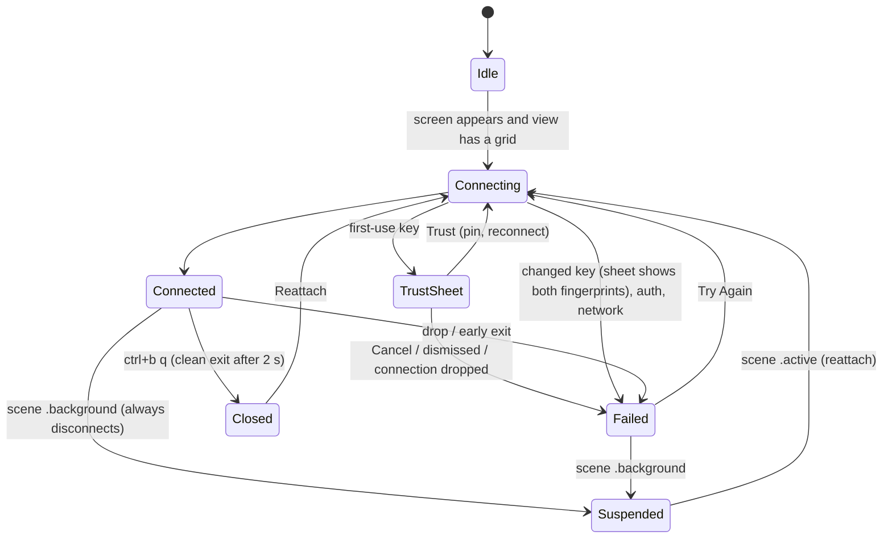

# Lane: app (w29:p3)

Owned paths: `project.yml`, `App/**`, `README.md`, `docs/lanes/app.md`, `docs/evidence/app/**`.

Stage: simulator acceptance done on iPhone 17 Pro Max and iPad Pro 13-inch (M5) simulators
against this Mac over its Tailscale address. The signed device build is done. Device install and
launch are waiting on the devices being unlocked (see [Devices](#devices)).

## What exists

- `App/HostsView.swift`: a `NavigationSplitView` host list. It collapses to a push stack on
  iPhone and hides the sidebar on iPad once a host is selected, so the terminal gets the full
  width. Add, edit and delete are in the toolbar, context menu and swipe actions. The key button
  opens the device key screen.
- `App/HostEditor.swift`: name, hostname, port, user, platform, herdr session, command override
  and password. The session is checked with `HerdrCommand.sessionNameError` (Save is disabled
  while it's invalid, unless a command override replaces the attach command). The placeholder
  previews the attach command. Forget Saved Password shows only when a password is saved.
  **Forget Host Key** asks for confirmation and clears the pin for the *saved* address.
- `App/DeviceKeyView.swift`: `DeviceKey.publicKeyOpenSSH()` with Copy and Share.
- `App/HostSession.swift`: one `HostSession` per host, kept in `SessionRegistry`. It owns a
  SwiftTerm view that outlives individual `TerminalSession`s, so switching hosts in the sidebar,
  or popping back on iPhone, leaves the other sessions attached.
- `App/TerminalContainer.swift`: `HerdrTerminalView` (a SwiftTerm `TerminalView` subclass), the
  hosting view with its gestures, and the `KeyBar` input accessory.
- `App/TerminalScreen.swift`: the terminal, a status overlay (connecting, reconnecting, failed
  with the multi-line reason, session ended), and the host-key sheet.



### Decisions

- **Always drop on background and reattach on active.** iOS kills sockets once an app is
  suspended, and HerdrKit has no keepalive, so a dead connection can still read `.connected`.
  `suspend()` always disconnects. `inBackground` gates *every* connect path, because iOS lays views
  out for app-switcher snapshots while backgrounded. The queued connect task re-checks that it is
  still the current connection before it calls `connect`. `App/Tests/HostSessionTests.swift` pins
  both. Mutation check: without the task guard, the two retired sessions went from `.idle` to
  `.failed`.
- **An approval only counts for the connection that asked.** Dropping a connection answers any
  open trust prompt with "no", and a generation counter keeps a stale `TerminalSession` from
  raising a new one.
- **Taps with the keyboard hidden.** SwiftTerm spends a tap on an unfocused view becoming first
  responder, so that tap never reaches herdr. `HerdrTerminalView.sendClick` reports it as a left
  click itself (SwiftTerm 1.20 already sends focused taps as button 0). Hiding the keyboard from the
  key bar turns off `canBecomeFirstResponder`, so later taps only click. The toolbar keyboard
  button brings it back.
- **Scrolling.** With herdr's mouse reporting on, one-finger drags are mouse drags, so there is no
  touch path to herdr's scrollback. Two-finger pans, and trackpad or wheel scrolls
  (`allowedScrollTypesMask = .all`), send wheel events at the touch location.
- **One scene.** `UIApplicationSupportsMultipleScenes` is false, because a session's terminal view
  can live in only one window. Split View and Stage Manager resizes still reflow.
- **Dark keyboard.** `keyboardAppearance = .dark` and a dark `KeyBar`. On a light-mode phone the
  gray key-bar buttons otherwise wash out against the light keyboard.
- **UI-test steady caret.** XCUITest waits for animations to settle before every action, and
  SwiftTerm's caret blink repeats forever (about 60 s per action). A `-steadyCaret` launch argument
  maps blink cursor styles to steady ones in `cursorStyleChanged`. Normal launches are unchanged.

## Evidence

Every run used the throwaway herdr session `herdr-ios-test` on this Mac, never the default session
(herdr sizes all panes to the foreground client). The session was deleted and recreated before each
live run. The host was `100.103.220.58`, user `james`, added through the editor by the UI test.

Live flow (`HerdrUITests.testLiveHerdr`): both simulators passed. Screenshots are in
[`docs/evidence/app/`](../evidence/app/), prefixed `iphone-` or `ipad-`.

| Step | iPhone | iPad | Host-side proof |
| --- | --- | --- | --- |
| Add host via editor | `iphone-add-host-filled.png` | `ipad-add-host-filled.png` | |
| First-use trust sheet | `iphone-trust-host-key.png` | `ipad-trust-host-key.png` | fingerprint matches `ssh-keygen -lf` |
| Live herdr TUI | `iphone-connected-portrait.png` (mobile layout) | `ipad-connected-portrait.png` (desktop layout) | |
| Typing, `↑` recall, sticky `ctrl`+`u` | `iphone-typed.png` | `ipad-typed.png` | pane `w1:p1`: `herdr-ios-typed` ×2, `herdr-ios-ctrl-ok`, no `ctrl-FAIL` |
| `⌃B` then `v` splits | `iphone-prefix-split-portrait.png` | `ipad-prefix-split-portrait.png` | `pane list`: `w1:p1`, `w1:p2` |
| Rotate to landscape | `iphone-landscape.png` (desktop layout) | `ipad-landscape.png` | |
| Tap left pane (keyboard up), tap right pane (keyboard hidden) | `iphone-tapped-landscape.png` | `ipad-tapped-landscape.png` | `w1:p1` has `herdr-ios-tapped-left`, `w1:p2` has `herdr-ios-tapped-right` |
| Rotate back | `iphone-rotated-back-portrait.png` | `ipad-rotated-back-portrait.png` | |
| Home, 8 s, reopen: auto reattach | `iphone-reattached.png` | `ipad-reattached.png` | new herdr client pid: iPhone 98740 → 99704, iPad 1333 → 2375 |

Host-key pinning (`HerdrUITests.testHostKeyPinning`) ran against a throwaway user-level sshd on
`127.0.0.1:2222`, whose host key was swapped between runs:

| Step | Evidence |
| --- | --- |
| First use of key A (`SHA256:JU62+w7n…`) | `iphone-trust-host-key.png`, then `iphone-pinned-connected.png` |
| Key swapped to B (`SHA256:/jwYkBwu…`): refused, both fingerprints shown | `iphone-host-key-changed.png`, `iphone-host-key-changed-refused.png`, `ipad-host-key-changed.png`, `ipad-host-key-changed-refused.png` |
| Forget Host Key in Edit Host, then Try Again prompts for B | `iphone-trust-after-forget.png` |

Unit test: `HostSessionTests.backgroundBlocksLayoutReconnect` passes on the iPhone simulator.

Running it:

```sh
xcodegen generate
xcodebuild -project Herdr.xcodeproj -scheme Herdr -destination 'id=<sim>' -skipPackagePluginValidation \
  -disableAutomaticPackageResolution build-for-testing
TEST_RUNNER_EVIDENCE_DIR=/tmp/ev TEST_RUNNER_EVIDENCE_TAG=iphone xcodebuild … test-without-building \
  -only-testing:HerdrUITests/HerdrUITests/testLiveHerdr
```

`-disableAutomaticPackageResolution` matters. Without it, `xcodebuild` sometimes sat in "Resolve
Package Graph" for 10+ minutes after a test.

## Devices

- Signed build: `generic/platform=iOS` with `-allowProvisioningUpdates` builds and signs with
  `Apple Development: James Volpe`, team `8YW4D4C6CW`, `iOS Team Provisioning Profile: *`.
- iPhone 17 Pro Max (`00008150-0016258C21F2401C`): `devicectl device install app` succeeded.
  Launch was refused: `Locked ("Unable to launch com.volpestyle.herdr because the device was not,
  or could not be, unlocked")`.
- iPad Pro 13 (`00008142-00117899226B401C`): install refused. `The developer disk image could not
  be mounted on this device … The device is currently locked.`

## Changes outside the repo

- `~/.ssh/authorized_keys` on this Mac has two added lines, tagged `herdr-ios-sim-iphone` and
  `herdr-ios-sim-ipad` (written by `scripts/authorize-key.sh local`). They are the simulators'
  device keys. Remove them with `sed -i '' '/herdr-ios-sim-/d' ~/.ssh/authorized_keys`.
- Xcode's Metal Toolchain component is installed (`xcodebuild -downloadComponent MetalToolchain`),
  because SwiftTerm's Metal shaders don't build without it.

## Gaps

- Device install and launch are blocked until both devices are unlocked.
- The physical devices' keys are not authorized anywhere yet. That needs the Device Key screen on
  each device, then `scripts/authorize-key.sh`.
- The app has not been run against the Windows PC. hosts (w29:p4) verified herdr over SSH on
  `supedupsilly`. The app side would be a `windows` profile with a throwaway session, run with the
  same `testLiveHerdr`.
- Not exercised: iPad hardware keyboard and pointer (SwiftTerm handles both), pinch font size
  (implemented and not driven by a test), and two-finger or trackpad wheel scrolling.
- The iPad forget-key recovery was driven only on iPhone. On iPad, XCUITest couldn't reach the
  sidebar row's context menu from the collapsed split view. It is the same `HostEditor` code.
