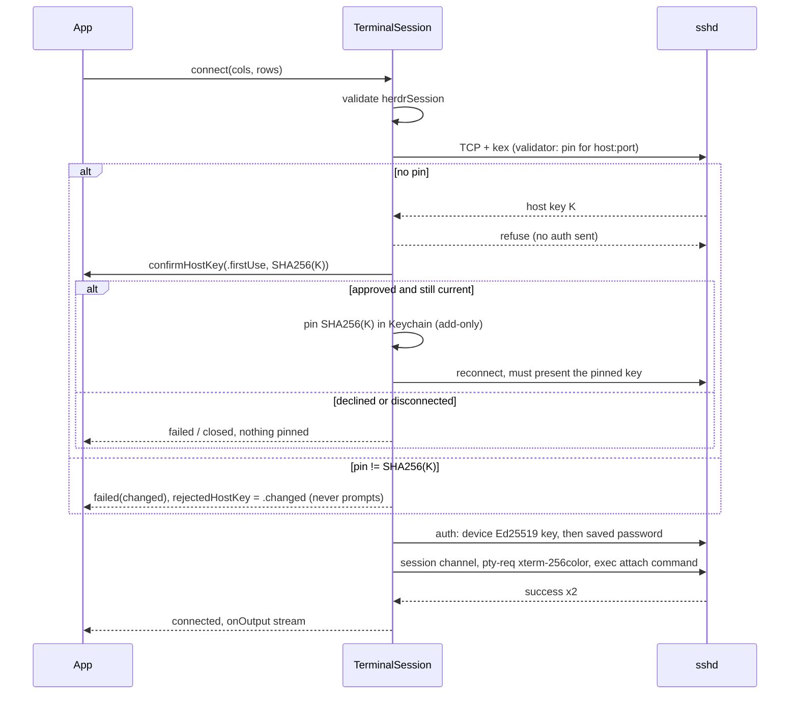

# Lane: transport (w29:p2)

Owned paths: `Packages/HerdrKit/**`, `docs/lanes/transport.md`.

Stage: done. `Packages/HerdrKit` is a Swift package (iOS 26, macOS 15) that implements the
[HerdrKit contract](../plan.md#herdrkit-contract-transport--app). It depends on swift-nio-ssh
0.15.0 and swift-nio. It does not use Citadel (see [Decisions](#decisions)).

## API delta vs the contract

Every contract signature exists as written. These members are additions, and the app lane
already uses them:

| Addition | Why |
| --- | --- |
| `HostProfile.init(id:name:hostname:port:username:platform:herdrSession:remoteCommand:)` | Public memberwise init, `port` defaults to 22, `platform` to `.unix`. |
| `HostStore.init(fileURL:)`, `HostStore.defaultFileURL` | Default is `Application Support/Herdr/hosts.json`. Tests pass a temp file. |
| `HostStore.hasPassword(for:)` | Lets the editor show that a password is saved without reading it. |
| `HostStore.forgetHostKey(hostname:port:)` | Recovery after a legitimate host rebuild. Otherwise a changed key stays refused forever. |
| `TerminalSession.profile`, `TerminalSession.rejectedHostKey` | `rejectedHostKey` carries the `.changed(previousFingerprint:)` challenge after a refusal, for the mismatch UI. |
| `HerdrCommand.sessionNameError(_:)` | herdr's own `validate_name` rule, returning herdr's message. Use it for form validation. |
| `HostKeyChallenge: Equatable` | Tests and UI diffing. |

Behavior the app relies on:

- `attach(platform:session:)` returns the strings in
  [host-setup](../host-setup.md#attach-commands). It never traps. An invalid name is quoted
  (POSIX for unix, PowerShell for windows), so it reaches herdr as one literal argument and herdr
  rejects it. `connect` refuses an invalid `herdrSession` before opening a socket:
  `failed("Invalid herdr session name: …")`. A non-blank `remoteCommand` is used verbatim.
- `failed(String)` can span several lines. When the channel closes, the message is the reason
  followed by up to 3 readable lines of the last output, with escape sequences stripped.
- End states: `disconnect()` gives `.closed`. A clean exit (status 0) more than 2 s after
  `.connected`, such as `ctrl+b q`, gives `.closed`. Any other exit is `.failed`. That covers exit
  0 within 2 s (Windows reports 0 when `herdr` isn't recognized), any non-zero status (127 names
  "not found"), and a dropped connection.
- `onOutput` gets stdout and stderr in order on the MainActor, one chunk per network read burst.
  `send` writes stdin, and `resize` sends an SSH window-change. The PTY is `xterm-256color` with
  IUTF8 set.
- Output has backpressure. The next read waits until `onOutput` returns, so a slow or blocked
  MainActor stalls the host in its SSH window instead of buffering in app memory.
- The hostname is canonicalized (trimmed, lowercased, trailing `.` dropped) for both the connect
  and the pin. `Host.ts.net.` and `host.ts.net` share one pin, while `100.x`, the short MagicDNS
  name and the FQDN each get their own, like `known_hosts`.

## Decisions

**NIOSSH directly, not Citadel.** ADR 0001 names Citadel, and I built on Citadel 0.12.1 first.
Citadel's only public way to get a connection you can open a custom channel on,
`SSHClient.connect(on:settings:)`, calls `channel.pipeline.syncOperations` from the caller's task.
That trips `NIOCore/ChannelPipeline.swift:1208: Precondition failed` (`assertInEventLoop`), and it
crashed the first test run. `SSHClientSettings.channelHandlers` is internal and never added. The
TTY API only offers pty-req + *shell* (`withPTY`), and the contract needs pty-req + exec.
Citadel's connect path wraps about 20 lines of NIOSSH, so `TerminalSession.open` adds
`NIOSSHHandler` and an auth waiter in the bootstrap's `channelInitializer` (on the loop). Dropping
Citadel also drops its dependency on a personal swift-nio-ssh fork (`Wellz26/swift-nio-ssh`) in
favor of upstream `apple/swift-nio-ssh`. The lead owns ADR 0001, which still says Citadel.

**Two-phase TOFU.** With no pin, the host key validator always refuses. So the first handshake
ends before auth, and no credential reaches an unconfirmed host. The session then asks
`confirmHostKey`, pins on approval, and reconnects. The second handshake must present exactly the
pinned fingerprint. Because of this, the trust prompt never sits inside a live handshake, where it
would hit handshake timeouts or sshd's `LoginGraceTime`. The state is decided from the key the
host presented, not from how NIO reported the failure. A disconnect during the prompt discards the
answer: generation checks follow every await. Pinning is add-only. If two sessions to a new host
both prompt, the later approval keeps the earlier pin, and its reconnect either matches that pin or
takes the changed-key refusal. A pin changes only through `forgetHostKey`.

**Backpressure.** The session channel runs with autoRead off. `PTYHandler` collects one read
burst into a single `.output` event, and the MainActor pump requests the next read after
`onOutput` returns. NIOSSH sends WINDOW_ADJUST only when bytes reach the pipeline, so unread
output waits in the host's SSH window (`maximumPacketSize` × 64), and at most one burst sits in the
app. Every NIO promise is completed on every path. A failed TCP connect fails the auth promise, and
a `createChannel` that fails before its initializer runs fails `ready`. NIO traps on a leaked
promise in debug builds.



**Storage.** Everything goes in the Keychain as generic passwords with
`kSecAttrAccessibleAfterFirstUnlockThisDeviceOnly`:

| Service | Account | Data |
| --- | --- | --- |
| `com.volpestyle.herdr.device-key` | `ed25519` | 32-byte raw private key, created on first use |
| `com.volpestyle.herdr.host-key` | canonical `hostname:port` | `SHA256:…` fingerprint |
| `com.volpestyle.herdr.password` | host UUID | password |

Pins are keyed by `hostname:port` like `known_hosts`, so deleting a profile doesn't forget its
pin. On iOS these items are always in the data-protection keychain. On macOS (tests only) they're
in the login keychain, because the data-protection keychain rejects unsigned binaries with
`-34018`. Host profiles are JSON written with `completeFileProtectionUntilFirstUserAuthentication`.
An unreadable file is moved aside as `hosts.json.corrupt` instead of being overwritten.

## Evidence

In `Packages/HerdrKit`:

- `swift build`: clean, no warnings in HerdrKit sources. `xcodebuild -scheme HerdrKit
  -destination 'generic/platform=iOS Simulator' build`: `BUILD SUCCEEDED`.
- `swift test`: 29 tests in 6 suites pass, and the 9 sshd tests are skipped. Run with no network
  setup:
  - Attach strings match host-setup exactly.
  - Invalid names are quoted instead of trapping. The unix attach command goes through real
    `/bin/sh` twice with a fake `herdr`, for 9 hostile names (`$(touch pwned)`, backticks, `;`,
    quotes, empty). herdr always receives `session attach <name>` and nothing executes.
  - herdr's name rule: 3 valid and 11 invalid cases.
  - DeviceKey output parses as an OpenSSH key, and fingerprints equal `ssh-keygen -l -E sha256`.
    Hostname spellings share one pin, and pins are add-only.
  - HostStore round-trips JSON and Keychain.
  - Output-tail stripping works on unix and ConPTY-shaped bytes.
  - An in-process NIOSSH server covers trust: first use approved pins the exact key, reconnects,
    and reaches auth. Declining pins nothing and makes no auth attempt. A changed key is refused
    without a prompt, the pin is untouched, and no auth attempt reaches the impostor. A disconnect
    during the prompt leaves `.closed`, no pin, and no second socket. An invalid session name
    fails before connecting.
  - A concurrent first-use approval keeps the first pin and refuses the other key as changed.
  - A refused channel open fails the session.
  - A refused TCP connect (`127.0.0.1:1`) fails the session instead of trapping on a leaked promise.
  - A channel open on a connection with no SSH handler completes `ready`.
- `HERDR_IOS_SSH_TEST=1 swift test`: 29 tests in 6 suites pass, against this Mac's sshd at
  `127.0.0.1:22` as `james` with the DeviceKey:
  - First use pins a fingerprint that is in `ssh-keyscan 127.0.0.1` | `ssh-keygen -l`.
  - `TERM=xterm-256color` and `stty size` = `24 80`. After `resize(120, 40)` and a sent line, it's
    `40 120`. stdin echoes back through `cat`, and stderr arrives. `disconnect()` gives `.closed`.
  - `exec "$SHELL" -lc 'herdr --version'` prints `herdr 0.9.1`, so the login shell finds Homebrew's
    herdr.
  - `exit 3` fails with status 3. A missing command fails with 127 and `command not found: …`.
  - A quick exit 0 fails with its output, and a clean exit after 2.2 s is `.closed`.
  - A changed pinned key against the real sshd is refused, and `rejectedHostKey` names the live
    fingerprint.
  - Backpressure: `onOutput` blocks the MainActor for 3 s on the first chunk while the host writes
    64 MB. The writer hasn't finished when the stall ends. All 64 MB then arrive, and no chunk is
    over 16 MB.
- Each of the leak, backpressure and add-only-pin tests fails against a scratch copy with its fix
  removed. Without backpressure, the 64 MB writer finishes during the stall.

### authorized_keys entry (remove later)

`~/.ssh/authorized_keys` on this Mac didn't exist. It now holds exactly one line (mode 600),
which the sshd suite uses:

```
from="127.0.0.1,::1,100.64.0.0/10" ssh-ed25519 AAAAC3NzaC1lZDI1NTE5AAAAIERrvlx0U2/xRcgre1YFPaR9v15A/8yd0h9T+UL06j8w herdr-ios-test
```

Remove it with `sed -i '' '/herdr-ios-test$/d' ~/.ssh/authorized_keys`. The private key is the
login-keychain item `com.volpestyle.herdr.device-key`/`ed25519`, created by the tests. Delete it
with `security delete-generic-password -s com.volpestyle.herdr.device-key -a ed25519`. The
hosts lane's `scripts/authorize-key.sh` doesn't write the `from=` restriction, so I added the
line by hand.

## Gaps

- No HerdrKit test attaches to a live herdr session. An attaching client resizes every pane in
  that session. The hosts lane verified attach, detach, mobile layout and reflow over `ssh -tt`
  with throwaway sessions, and the app lane covers the app end to end.
- HerdrKit hasn't connected to Windows. The device key isn't authorized on supedupsilly. A raw
  `ssh -tt` capture there (missing command) returned only ConPTY control sequences and exit 0,
  which the quick-exit rule and output tail handle.
- The password fallback (method `password`) is untested. This Mac's sshd config wasn't touched.
  NIOSSH has no `keyboard-interactive`, so a host that only allows keyboard-interactive needs the
  device key.
- For an invalid session name, `attach(.windows, …)` quoting is PowerShell-safe but not cmd.exe
  safe. `TerminalSession` never sends invalid names. This only matters to a caller that runs
  `attach` output directly on a cmd.exe-default host.
- There's no SSH keepalive. iOS drops the socket in the background anyway, and the app reconnects
  on return.
